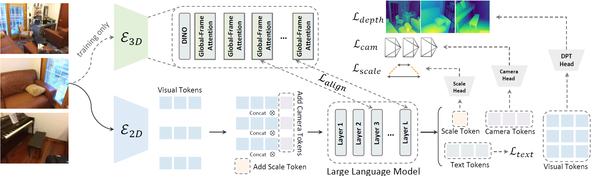

<h2 align="center"> GeoVR: Learning Geometric Video Representations for Spatial Intelligence within Multimodal Large Language Models </h2>

🌟 This is the official repository of the GeoVR, a paradigm to restructure MLLM’s intrinsic representations with geometric awareness using purely 2D videos for Spatial Intelligence.

<div align="center">
  
</div><br/>

💡 We sharpen our model by incorporating:
- **Multi-Objective Geometric Learning:** Jointly optimizing camera poses, depth maps and metric scales to capture dynamic multi-view consistency and static physical scales.
- **Hierarchical Feature Distillation:** Aligning multi-scale representations from 3D foundation models (e.g., VGGT) to seamlessly bridge low-level geometry and high-level 3D semantics.

## 📝 TODO List

- [x] Release training/evaluation scripts and GeoVR-2B/4B weights
- [ ] Release GeoVR-8B weights trained on mixed datasets

## 🛠️ Install
1. Clone this repository and navigate to folder
```bash
git clone git@github.com:WHB139426/GeoVR-MLLM.git
cd GeoVR-MLLM
```

2. Install Package
```Shell
conda create -n geovr python=3.10.14
conda activate geovr
pip install -r requirements.txt
pip install numpy==1.26.4
pip install flash-attn==2.7.3 --no-build-isolation
```

## 🤗 Prepare the pretrained weights
Set your own `weight_path` to storage the pretrained weights. 

1. Download our released model weights

| Model | Base Model | Data | Download |
| :--- | :--- | :--- | :--- |
| `GeoVR-Qwen3-VL-2B` | Qwen3-VL-2B-Instruct | VSI-590K + VLM-3R | [🤗TBD](xxx) |
| `GeoVR-Qwen3-VL-4B` | Qwen3-VL-4B-Instruct | VSI-590K + VLM-3R | [🤗TBD](xxx) |

2. Download the pretrained weights (Optional, only for training) [[🤗VGGT-Omega](https://huggingface.co/facebook/VGGT-Omega)], [[🤗VGGT-1B](https://huggingface.co/facebook/VGGT-1B)], [[🤗DA3-GIANT-1.1](https://huggingface.co/depth-anything/DA3-GIANT-1.1)], [[🤗DA3METRIC-LARGE](https://huggingface.co/depth-anything/DA3METRIC-LARGE)], [[🤗Qwen3-VL](https://huggingface.co/collections/Qwen/qwen3-vl)] in your own `weight_path`. 

The folder should be organized as follows: 
```
├── GeoVR
│   └── models
│   └── training
│   └── utils
│   └── scripts
│   └── vggt
│   └── vggt_omega
│   └── depth_anything_3
│   └── ...
├── weight_path
│   └── GeoVR-Qwen3-VL-2B
│   └── GeoVR-Qwen3-VL-4B
│   └── Qwen3-VL-2B-Instruct (Optional, only for training)
│   └── Qwen3-VL-4B-Instruct (Optional, only for training)
│   └── Qwen3-VL-8B-Instruct (Optional, only for training)
│   └── VGGT-Omega (Optional, only for training)
│   └── VGGT-1B (Optional, only for training)
│   └── DA3-GIANT-1.1 (Optional, only for training)
│   └── DA3METRIC-LARGE (Optional, only for training)
│   └──...
```


## 🚀 Qucik Start
We give a brief example to run the model with a few lines of code:
```python
import torch
from utils.utils import *
from transformers import AutoProcessor
from models.qwen3vl_geo import Qwen3VLForConditionalGeneration

device = 'cuda:0'
model_id = "/your/path/to/GeoVR-Qwen3-VL-2B"

model = Qwen3VLForConditionalGeneration.from_pretrained(
    model_id,
    geometry_encoder_path=None,
    metric_model_path=None,
    dtype=torch.bfloat16,
    attn_implementation="flash_attention_2",
    add_camera=False,
    add_scale=False,
    add_depth=False,
    distill_geometry_feature=False,
)
model.load_geometric_weights(model_id)
model.to(device)

num_frames = 32
processor = AutoProcessor.from_pretrained(model_id)
processor.video_processor.size = {"longest_edge": 384*num_frames*32*32, "shortest_edge": 4*num_frames*32*32}

messages = [
    {
        "role": "user",
        "content": [
            {"type": "video", "video": './assets/scene0086_02.mp4',},
            {"type": "text", "text": "What is the length of the longest dimension (length, width, or height) of the window, measured in centimeters?\nPlease answer the question ONLY using a single Arabic numeral."},
        ],
    }
]

generation_kwargs = {
    'do_sample': True,
    'top_p': 0.8,
    'top_k': 20,
    'temperature': 0.7,
    'repetition_penalty': 1.0,
    'max_new_tokens': 32*1024,
}

inputs = processor.apply_chat_template(
    messages,
    tokenize=True,
    add_generation_prompt=True,
    return_dict=True,
    return_tensors="pt",
    num_frames=num_frames,
    fps=None,
    enable_thinking=False,
).to(model.device)

with torch.cuda.amp.autocast(enabled=True, dtype=torch.bfloat16):
    with torch.inference_mode():
        generated_ids = model.generate(**inputs, **generation_kwargs) 
        output_text = processor.batch_decode(generated_ids, skip_special_tokens=True, clean_up_tokenization_spaces=False)[0].strip()
print(output_text)
```


## 📊 Evaluation
1. Download the benchmark [[🤗VSI-Bench](https://huggingface.co/datasets/nyu-visionx/VSI-Bench)] into your own `data_path` and unzip the downloaded files. The folder should be organized as follows: 
```
├── data_path
│   └── VSI-Bench
│       └── test.jsonl
│       └── scannet/
│       └── scannetpp/
│       └── arkitscenes/
│       └──...
```
2. In the script (`scripts/eval.sh`), change the `MODEL_ID` to `weight_path/GeoVR-Qwen3-VL-2B` and `DATA_DIR` to `data_path/VSI-Bench`.
3. Execute the evaluation script. You can easily control the number of GPUs used for parallel inference by modifying `NUM_GPUS` and `CUDA_VISIBLE_DEVICES` within the script.
```bash
bash scripts/eval.sh
```

## 💡 Training
1. Download the training data [[🤗VSI-590K](https://huggingface.co/datasets/nyu-visionx/VSI-590K)], [[🤗VLM-3R-DATA](https://huggingface.co/datasets/Journey9ni/VLM-3R-DATA)] into your own `data_path` and unzip the downloaded files. The folder should be organized as follows:
```
├── data_path
│   └── VSI-590K
│       └── vsi_590k.jsonl
│       └── arkitscenes/
│       └── scannet/
│       └── scannetppv2/
│   └── VLM-3R-DATA
│       └── vlm3r_vsi_205k.json
│       └── vsibench_train/
│       └── vstibench_train/
```
2. In the script (`scripts/train.sh`), change the `llm` to `weight_path/Qwen3-VL-2B-Instruct`, `geo` to `weight_path/VGGT-1B`, `metric` to `weight_path/DA3METRIC-LARGE`, `data_path` to `data_path`, and `output_dir` to `weight_path/checkpoints`.
3. Execute the training script.
```bash
bash scripts/train.sh
```

## ✏️ Citation
If you find our paper and code useful in your research, please consider giving a star :star: and citation :pencil:.
```BibTeX

```

## 🤝 Acknowledgement
We are grateful for the following awesome projects our work arising from: [Qwen3-VL](https://github.com/QwenLM/Qwen3-VL), [VGGT-Omega](https://github.com/facebookresearch/vggt-omega), [VGGT](https://github.com/facebookresearch/vggt), [Depth-Anything-3](https://github.com/ByteDance-Seed/Depth-Anything-3).